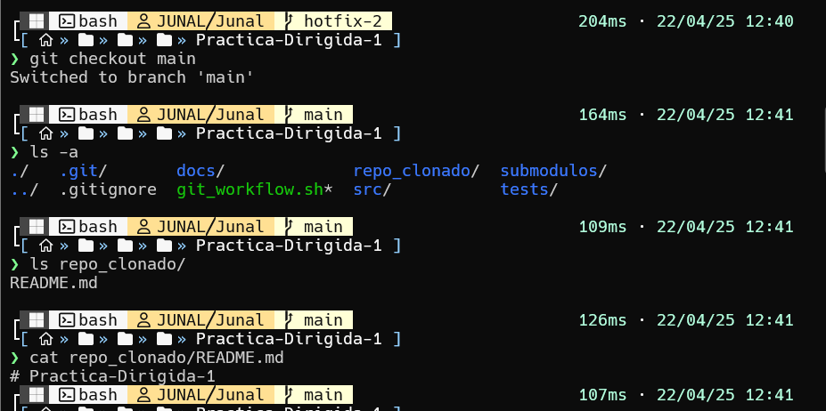
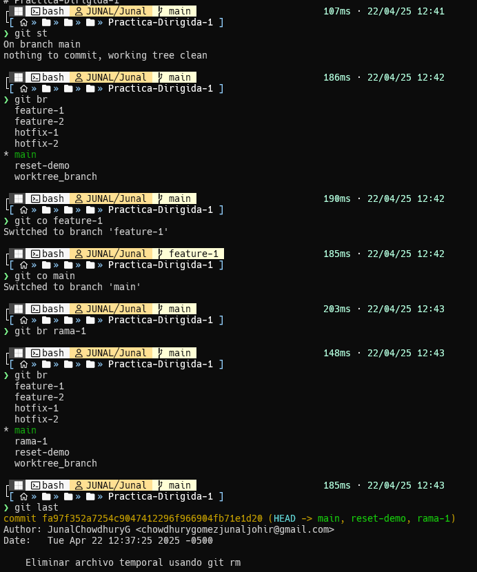
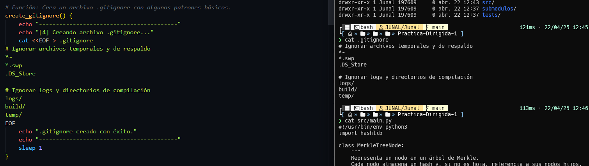
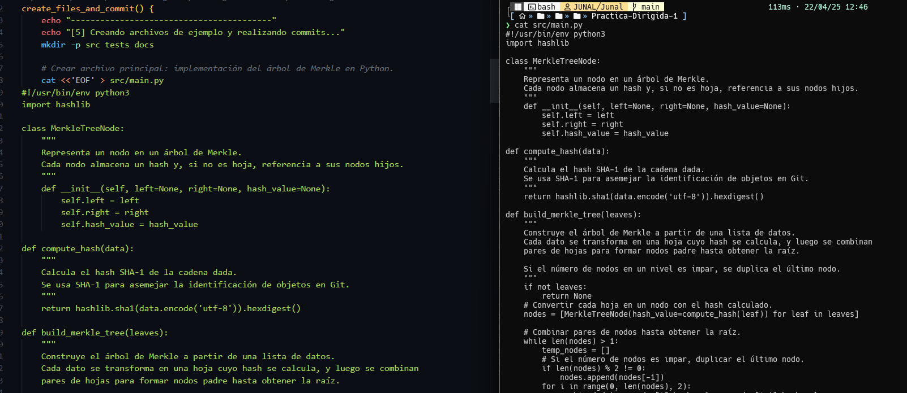
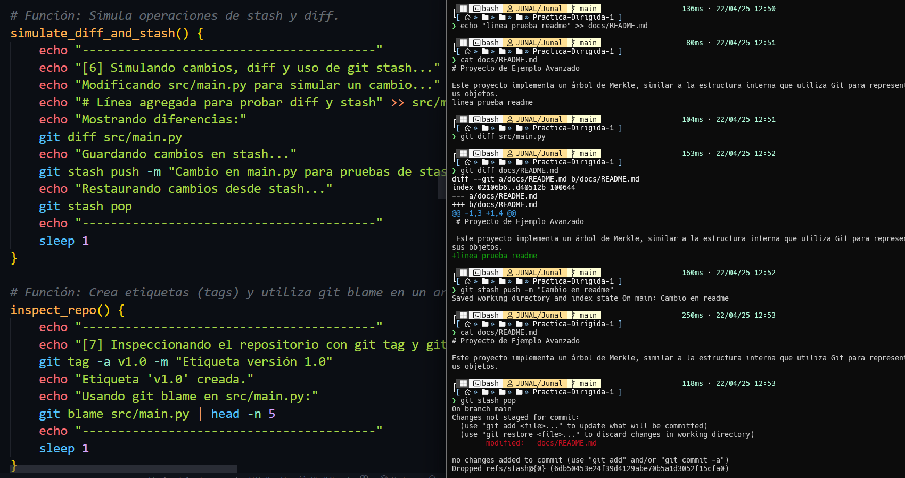
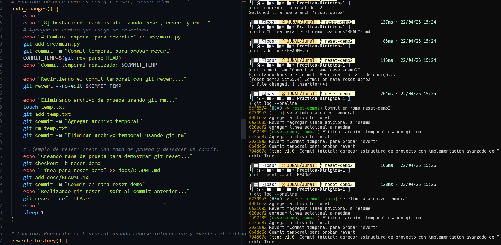
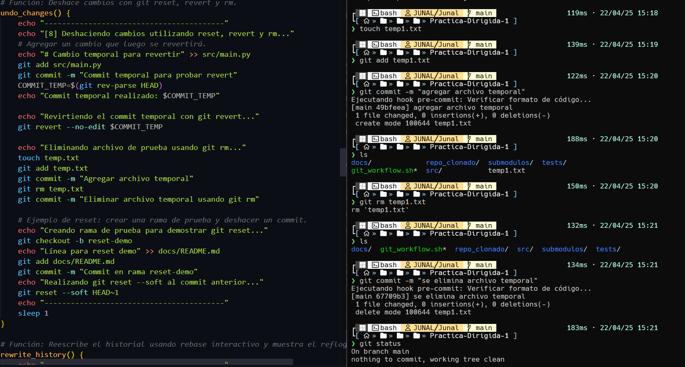
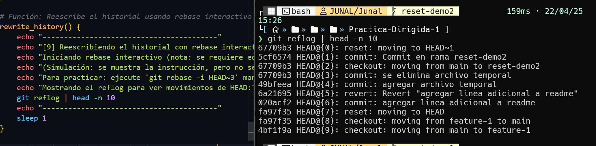

# Practica-Dirigida-1

1. Inicializa un repositorio si no existe.

 Clona un repositorio remoto si se proporciona URL.

2.  Configura alias y opciones personalizadas en Git

3. Crea un archivo .gitignore con algunos patrones básicos

4. Crea archivos de ejemplo, los agrega y realiza commits.

5. Simula operaciones de stash y diff.

6. Crea etiquetas (tags) y utiliza git blame en un archivo

7.  Deshace cambios con git reset

8. Deshace cambios con git rm

9. Reescribe el historial usando rebase interactivo y muestra el reflog.

